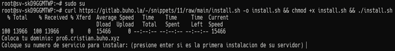
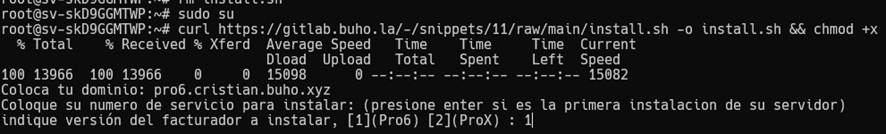

## Introducción

Esta guía explica el proceso para descargar e instalar el sistema facturador en máquinas con sistema operativo Ubuntu utilizando Docker. El proceso es simple y automatizado mediante un script de instalación.

<Note>
  Docker proporciona un entorno aislado y consistente que facilita la implementación y ejecución del facturador sin interferir con otras aplicaciones de tu servidor.
</Note>

## Requisitos previos

Antes de comenzar la instalación, asegúrate de cumplir con los siguientes requisitos:

<AccordionGroup>
  <Accordion title="Acceso SSH al servidor">
    Necesitas tener acceso a tu servidor, VPS, máquina virtual o entorno local mediante SSH. Puedes utilizar herramientas como Putty o WinSCP para facilitar la conexión remota.
  </Accordion>
  <Accordion title="Configuración de dominio">
    Tu dominio debe estar correctamente configurado y apuntando a la IP de tu servidor:
    - Configura el registro A con la dirección IP de tu servidor
    - Añade un registro CNAME con valor "*" para habilitar los subdominios que utilizará la aplicación
  </Accordion>
  <Accordion title="Puertos libres">
    Si en tu servidor tienes servicios que están utilizando MySQL, Apache o Nginx, deberás detenerlos ya que ocupan los puertos que usará el facturador con los contenedores de Docker.
  </Accordion>
</AccordionGroup>

## Proceso de instalación

Sigue estos pasos para instalar el facturador en tu servidor Linux:

### 1. Acceder como superusuario

Conéctate a tu servidor mediante SSH y obtén privilegios de superusuario:

```bash
sudo su
```

### 2. Ejecutar el script de instalación

Ejecuta el siguiente comando en la terminal para descargar y ejecutar el script de instalación:

```bash
curl https://gitlab.buho.la/-/snippets/14/raw/main/install.sh -o install.sh && chmod +x install.sh && ./install.sh 
```

### 3. Configuración del sistema

Durante la ejecución del script, se te solicitará ingresar la siguiente información:

<Steps>
  <Step title="Configurar dominio">
    Ingresa el dominio que configuraste previamente en los registros DNS.
  </Step>
  <Step title="Número de servicio">
    - Si es tu primera instalación, presiona Enter para utilizar el valor predeterminado (1)
    - Si ya tienes otros proyectos instalados, ingresa el número correlativo siguiente
    
    
  </Step>
  <Step title="Seleccionar versión">
    Elige la versión del facturador que deseas instalar:
    - Pro6 [1]
    - ProX [2]
    
    
  </Step>
  <Step title="Clonar repositorio">
    El sistema te pedirá tus credenciales de acceso al repositorio. Verifica que ingreses correctamente usuario y contraseña para evitar errores durante la instalación.
  </Step>
  <Step title="Configurar SSL">
    Se te preguntará si deseas instalar un certificado SSL gratuito (Let's Encrypt):
    
    - Si respondes "s" (Sí): Deberás confirmar dos preguntas adicionales con "y". El sistema te mostrará un código que deberás añadir como registro TXT con el nombre _acme-challenge.tudominio.com en tu panel DNS.
    
    - Si respondes "n" (No): La instalación continuará sin SSL. Ten en cuenta que los navegadores modernos mostrarán advertencias por falta de HTTPS.
    
    <Warning>
      Los certificados SSL gratuitos deben renovarse cada 90 días. El sistema te notificará cuando sea necesario.
    </Warning>
  </Step>
</Steps>

### 4. Finalización

Al completar la instalación, el sistema mostrará información importante sobre tu facturador:

- Ruta del proyecto en el servidor
- URL de acceso al facturador
- Correo electrónico del administrador
- Contraseña de acceso
- Contraseña para acceder a MySQL
- Clave SSH

<Tip>
  Toda esta información se guarda automáticamente en un archivo de texto para futuras referencias. Puedes acceder a él en cualquier momento con el siguiente comando:
  
  ```bash
  cat [tu-dominio].txt
  ```
</Tip>

## Acceso al sistema

Una vez finalizada la instalación, puedes acceder al facturador a través de la URL proporcionada durante el proceso. Utiliza las credenciales indicadas para iniciar sesión como administrador.

## Administración de Docker

<CardGroup cols={2}>
  <Card 
    title="Gestión de contenedores" 
    icon="docker">
    Una vez instalado el sistema, puedes administrar los contenedores Docker con los comandos estándar como `docker ps`, `docker logs` y `docker-compose`.
  </Card>
  <Card 
    title="Mantenimiento" 
    icon="wrench">
    Para actualizaciones y mantenimiento, asegúrate de realizar copias de seguridad regulares de tus datos y configuraciones.
  </Card>
</CardGroup>

## Solución de problemas comunes

<AccordionGroup>
  <Accordion title="Error de permisos">
    Si experimentas errores de permisos, asegúrate de estar ejecutando los comandos como superusuario (`sudo su`).
  </Accordion>
  <Accordion title="Problemas con puertos">
    Verifica que no haya otros servicios utilizando los puertos 80, 443 o 3306 antes de la instalación.
  </Accordion>
  <Accordion title="Fallo en la conexión a la base de datos">
    Revisa la configuración de la base de datos en el archivo de credenciales y asegúrate de que el contenedor de MySQL esté funcionando correctamente.
  </Accordion>
  <Accordion title="Certificado SSL no válido">
    Si elegiste instalar SSL pero no configuraste correctamente el registro TXT, puedes reintentar el proceso ejecutando el comando de renovación de certificados.
  </Accordion>
</AccordionGroup>

## Recursos adicionales

<CardGroup cols={2}>
  <Card 
    title="Documentación Docker" 
    href="https://docs.docker.com" 
    icon="docker">
    Consulta la documentación oficial de Docker para aprender más sobre la gestión de contenedores.
  </Card>
  <Card 
    title="Soporte técnico" 
    href="#" 
    icon="headset">
    Si necesitas ayuda adicional, contacta con nuestro equipo de soporte técnico.
  </Card>
</CardGroup>