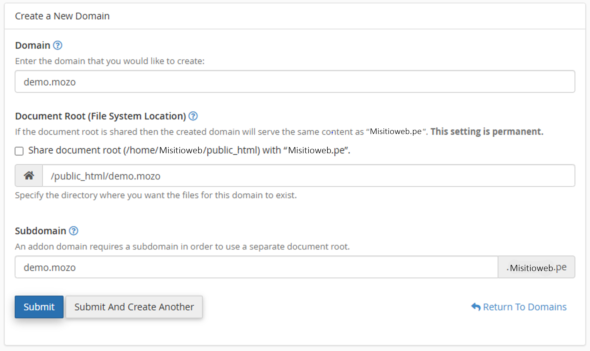
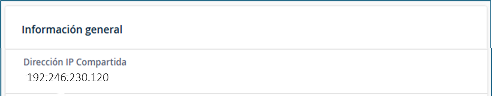
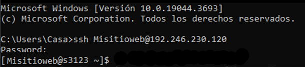
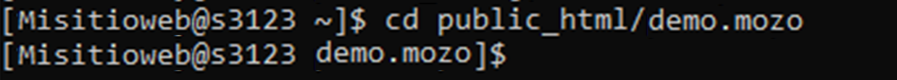
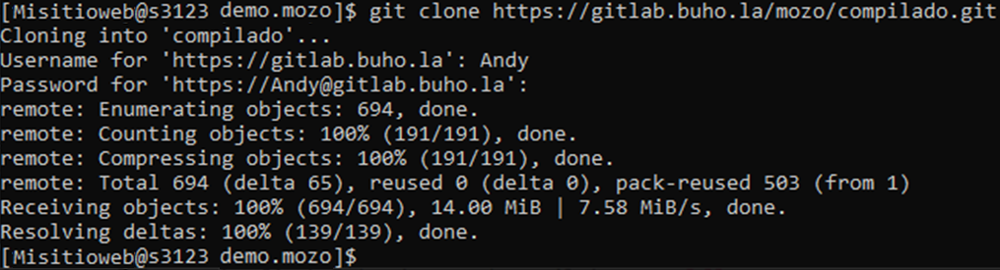
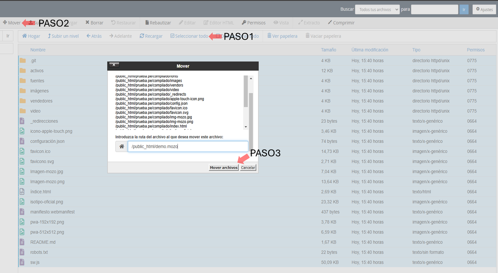
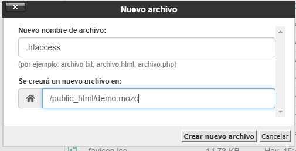
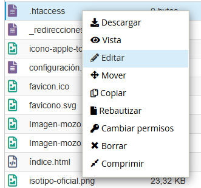
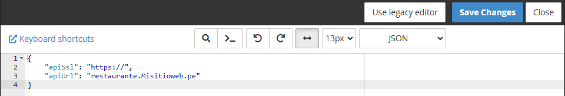

## Introducción

En esta guía encontrarás las instrucciones completas para instalar la aplicación Mozo en un servidor con cPanel. El proceso incluye la creación del dominio, la conexión SSH y la configuración posterior a la instalación.

## Requisitos previos

Antes de comenzar la instalación, asegúrate de contar con:

<CardGroup cols={2}>
  <Card 
    title="Compilado Mozo" 
    href="https://gitlab.buho.la/mozo/compilado" 
    icon="box">
    Acceso al repositorio de Gitlab que contiene el compilado de la aplicación Mozo.
  </Card>
  <Card 
    title="Cuenta cPanel" 
    icon="server">
    Credenciales de acceso a una cuenta cPanel con privilegios de administrador.
  </Card>
</CardGroup>

## Proceso de instalación

Sigue estos pasos para realizar una instalación completa de Mozo en tu servidor cPanel:

### 1. Creación del dominio

<Steps>
  <Step title="Acceder a cPanel">
    Inicia sesión en tu cuenta de cPanel con tus credenciales de administrador.
  </Step>
  <Step title="Crear nuevo dominio">
    Navega a la sección **Dominios > Crear un Nuevo Dominio** en el panel de control.
  </Step>
  <Step title="Configurar el dominio">
    En la interfaz de creación de dominio:
    1. Ingresa el nombre del dominio que deseas utilizar para Mozo
    2. **IMPORTANTE**: Desmarca la casilla que aparece en la configuración
    3. Agrega `public_html/` en el campo de nombre de carpeta
    
    
    
    <Warning>
      Es fundamental desmarcar la casilla y agregar **public_html/** en el nombre de la carpeta para que la instalación funcione correctamente.
    </Warning>
  </Step>
</Steps>

### 2. Conexión SSH a cPanel

<Steps>
  <Step title="Obtener credenciales de conexión">
    Localiza el **Usuario** y la **Dirección IP** de tu cuenta cPanel para establecer la conexión SSH.
    
    
    
    <Tip>
      El nombre de usuario es el mismo que utilizas para ingresar a tu cuenta de cPanel.
    </Tip>
  </Step>
  <Step title="Establecer conexión SSH">
    1. Abre una terminal o símbolo del sistema (cmd) en tu computadora
    2. Ejecuta el siguiente comando SSH reemplazando los valores correspondientes:
    
    ```bash
    ssh [Usuario]@[DirecciónIP]
    ```
    
    Por ejemplo:
    ```bash
    ssh Misitioweb@192.246.230.120
    ```
    
    
  </Step>
  <Step title="Navegar al directorio del dominio">
    Una vez conectado mediante SSH, accede a la carpeta del dominio que creaste:
    
    ```bash
    cd public_html/demo.mozo
    ```
    
    
    
    <Note>
      Reemplaza "demo.mozo" con el nombre de tu dominio en caso de ser diferente.
    </Note>
  </Step>
</Steps>

### 3. Instalación del compilado

<Steps>
  <Step title="Clonar el repositorio">
    Ejecuta el siguiente comando para clonar el repositorio de Mozo:
    
    ```bash
    git clone https://gitlab.buho.la/mozo/compilado.git
    ```
  </Step>
  <Step title="Ingresar credenciales">
    Cuando se solicite, ingresa tus credenciales de acceso a GitLab para autorizar la descarga.
    
    
  </Step>
</Steps>

### 4. Configuración post-instalación

<Steps>
  <Step title="Organizar archivos">
    1. Regresa a tu panel de cPanel y navega a la sección de Dominios
    2. Accede al administrador de archivos y dirígete a la ruta de tu dominio
    3. Mueve todo el contenido de la carpeta `compilado` al directorio raíz de tu dominio
    
    
    
    <Tip>
      Una vez hayas movido todos los archivos, puedes eliminar la carpeta `compilado` vacía para mantener organizado tu directorio.
    </Tip>
  </Step>
  <Step title="Configurar archivo .htaccess">
    1. Crea un nuevo archivo en la raíz de tu dominio y nómbralo `.htaccess`
    
    
    
    2. Edita el archivo y agrega la siguiente configuración:
    
    ```apache
    # Archivo necesario cuando publiques la app en apache y que funcione el SPA
    <IfModule mod_rewrite.c>
    RewriteEngine On

        # Condición: si el archivo o directorio solicitado no existe
        RewriteCond %{REQUEST_FILENAME} !-f
        RewriteCond %{REQUEST_FILENAME} !-d

        # Redirigir todas las peticiones al index.html
        RewriteRule ^ index.html [L]
    </IfModule>
    ```
    
    
    
    <Note>
      Esta configuración es esencial para que la aplicación SPA (Single Page Application) funcione correctamente en el servidor Apache.
    </Note>
  </Step>
  <Step title="Configurar archivo config.json">
    1. Abre el archivo `config.json` ubicado en la raíz de tu dominio
    2. Verifica que la ruta principal esté correctamente configurada para tu entorno
    
    
    
    3. Guarda los cambios realizados y cierra el editor
  </Step>
</Steps>

## Verificación de la instalación

Una vez completados todos los pasos de instalación, accede a tu dominio a través del navegador para verificar que la aplicación Mozo está funcionando correctamente.

<CardGroup cols={2}>
  <Card 
    title="Verificar conexión API" 
    icon="cloud">
    Asegúrate de que la aplicación Mozo pueda conectarse correctamente a la API del sistema de facturación.
  </Card>
  <Card 
    title="Prueba de funcionalidades" 
    icon="check-circle">
    Realiza una prueba de las funciones principales para confirmar que la instalación se completó exitosamente.
  </Card>
</CardGroup>

## Solución de problemas comunes

<AccordionGroup>
  <Accordion title="Error de conexión a la API">
    Verifica que la URL de la API en el archivo config.json sea correcta y accesible desde el servidor donde está instalada la aplicación Mozo.
  </Accordion>
  <Accordion title="Problemas con rutas de navegación">
    Si experimentas errores de rutas o la aplicación muestra pantallas en blanco, confirma que el archivo .htaccess está correctamente configurado.
  </Accordion>
  <Accordion title="Archivos no visibles">
    Si después de mover los archivos no los ves reflejados, intenta actualizar el administrador de archivos o verifica los permisos de lectura y escritura.
  </Accordion>
</AccordionGroup>

## Recursos adicionales

<CardGroup cols={2}>
  <Card 
    title="Documentación de Mozo" 
    href="/pro-7/mozo" 
    icon="book">
    Consulta la documentación completa de la aplicación Mozo para conocer todas sus funcionalidades.
  </Card>
  <Card 
    title="Soporte técnico" 
    href="#" 
    icon="headset">
    Si encuentras dificultades durante la instalación, contacta con nuestro equipo de soporte técnico.
  </Card>
</CardGroup>