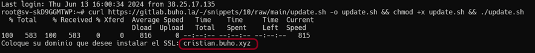
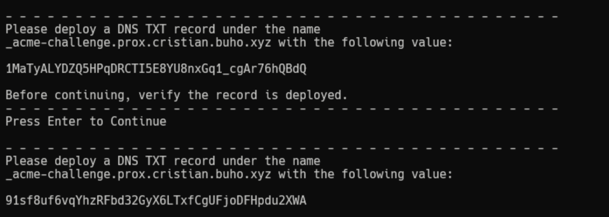
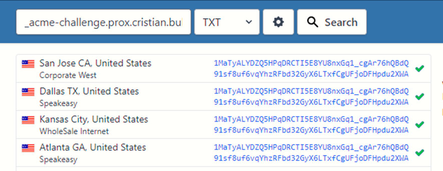
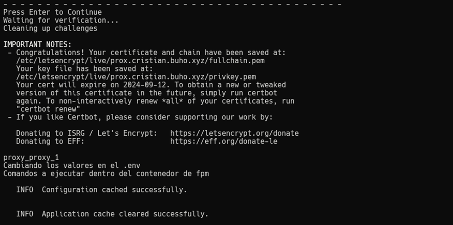

## Introducción

Si durante la instalación del facturador elegiste no configurar el certificado SSL, esta guía te mostrará cómo instalarlo posteriormente. También encontrarás instrucciones para renovar tu certificado cuando expire.

<Warning>
  Los certificados SSL gratuitos (Let's Encrypt) tienen una duración de 30 días. Una vez transcurrido este periodo, deberás renovarlo siguiendo los pasos de actualización descritos en esta guía.
</Warning>

## Primera instalación de SSL

Sigue estos pasos para instalar un certificado SSL por primera vez en tu dominio:

<Steps>
  <Step title="Acceder como superusuario">
    Conéctate a tu VPS mediante SSH y obtén privilegios de superusuario:
    
    ```bash
    sudo su 
    ```
  </Step>
  <Step title="Descargar y ejecutar el script">
    Ejecuta el siguiente comando para descargar y ejecutar el script de instalación de SSL:
    
    ```bash
    curl https://gitlab.buho.la/-/snippets/12/raw/main/newSSL.sh -o updateFirstSSL.sh && chmod +x updateFirstSSL.sh && ./updateFirstSSL.sh
    ```
  </Step>
  <Step title="Configurar dominio">
    Ingresa el dominio donde deseas instalar el certificado SSL.
    
    <Note>
      Si no ingresas un dominio, el script terminará su ejecución.
    </Note>
    
    
  </Step>
  <Step title="Configurar correo electrónico">
    Proporciona una dirección de correo electrónico válida para registrar el certificado. Recibirás notificaciones importantes relacionadas con tu certificado en esta dirección.
  </Step>
  <Step title="Configurar registro DNS">
    El sistema te mostrará dos cadenas de texto que deberás añadir como registros TXT en tu configuración DNS:
    
    1. Crea un registro TXT con el nombre: `_acme-challenge.[tu-dominio]`
    2. Ingresa como valor la cadena de texto proporcionada por el script
    
    
    
    <Warning>
      Antes de continuar, verifica que los registros TXT se hayan propagado correctamente en Internet. Puedes utilizar herramientas como [WhatsMy DNS](https://www.whatsmydns.net/) para comprobarlo.
    </Warning>
    
    
    
    Una vez confirmada la propagación de los registros, presiona Enter para continuar.
  </Step>
  <Step title="Completar verificación">
    El sistema realizará una verificación de los registros DNS y, si todo está configurado correctamente, mostrará un mensaje de confirmación:
    
    
  </Step>
</Steps>

## Renovación de certificados SSL

Cuando tu certificado SSL esté próximo a expirar, deberás renovarlo siguiendo estos pasos:

<Steps>
  <Step title="Acceder como superusuario">
    Conéctate a tu VPS mediante SSH y obtén privilegios de superusuario:
    
    ```bash
    sudo su 
    ```
  </Step>
  <Step title="Descargar y ejecutar el script de renovación">
    Ejecuta el siguiente comando para descargar y ejecutar el script de renovación de SSL:
    
    ```bash
    curl https://gitlab.buho.la/-/snippets/13/raw/main/updateSSL.sh -o updateSSL.sh && chmod +x updateSSL.sh && ./updateFirstSSL.sh
    ```
  </Step>
  <Step title="Completar el proceso">
    A partir de este punto, el proceso es idéntico al de la primera instalación de SSL descrito anteriormente, comenzando desde el paso 3 (configuración del dominio).
  </Step>
</Steps>

## Verificación del certificado

Una vez instalado o renovado el certificado SSL, puedes verificar que funciona correctamente accediendo a tu sitio con el protocolo HTTPS:

```
https://tu-dominio.com
```

<CardGroup cols={2}>
  <Card 
    title="Verificación del certificado" 
    icon="lock">
    Para verificar la validez de tu certificado, haz clic en el icono de candado en la barra de direcciones de tu navegador.
  </Card>
  <Card 
    title="Resolución de problemas" 
    icon="bug">
    Si experimentas problemas con tu certificado, asegúrate de que los registros DNS estén correctamente configurados y que el script se haya ejecutado sin errores.
  </Card>
</CardGroup>

## Solución de problemas comunes

<AccordionGroup>
  <Accordion title="Error en la validación de dominio">
    Si el sistema no puede validar tu dominio, verifica que:
    - Los registros TXT estén correctamente configurados
    - Hayas esperado el tiempo suficiente para la propagación DNS (puede tomar hasta 48 horas)
    - El dominio apunte correctamente a la IP de tu servidor
  </Accordion>
  <Accordion title="Certificado SSL no se aplica correctamente">
    Si después de la instalación tu sitio sigue mostrando como no seguro:
    - Verifica que el servidor web se haya reiniciado correctamente
    - Limpia la caché de tu navegador
    - Comprueba que no existan redirecciones a HTTP en tu configuración
  </Accordion>
  <Accordion title="Errores en el script">
    Si el script muestra errores durante la ejecución:
    - Asegúrate de estar ejecutándolo como superusuario
    - Verifica la conectividad de red de tu servidor
    - Comprueba que no haya restricciones de firewall que bloqueen las conexiones necesarias
  </Accordion>
</AccordionGroup>

## Información adicional

<Note>
  Los certificados SSL de Let's Encrypt son gratuitos pero requieren renovación periódica. Considera configurar recordatorios para renovar tu certificado antes de que expire.
</Note>

Para más información sobre certificados SSL y su importancia para la seguridad de tu sitio web, consulta la [documentación oficial de Let's Encrypt](https://letsencrypt.org/docs/).