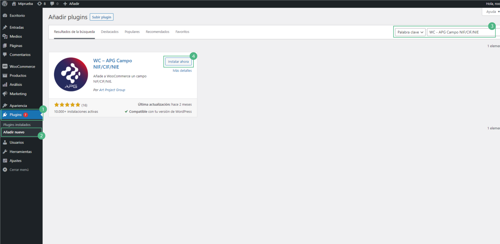
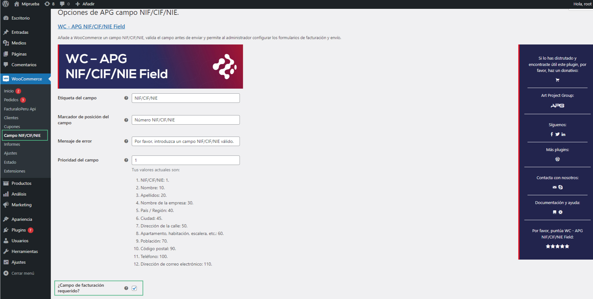
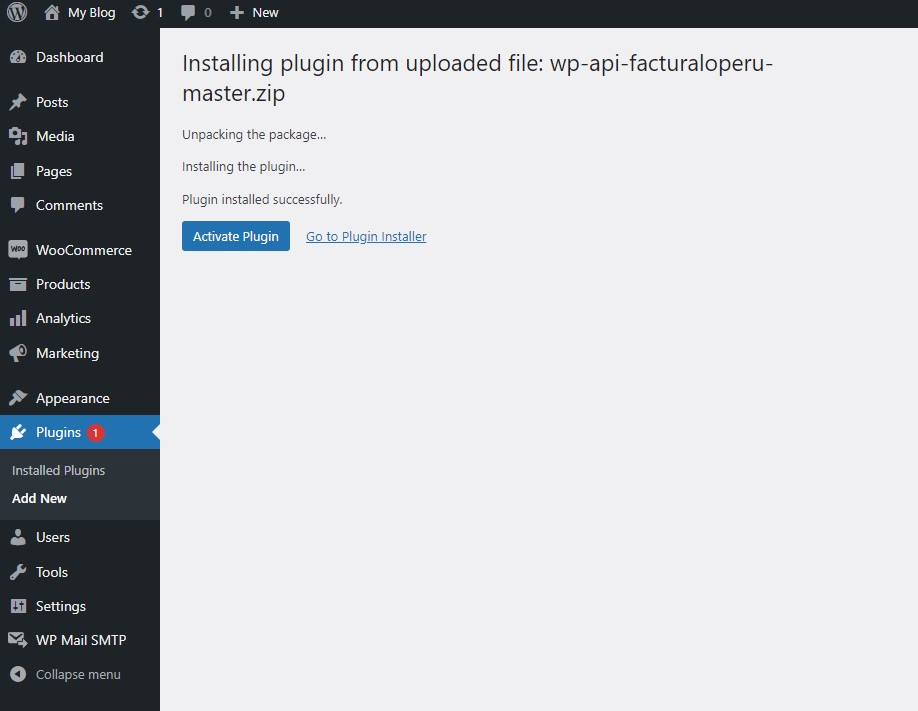
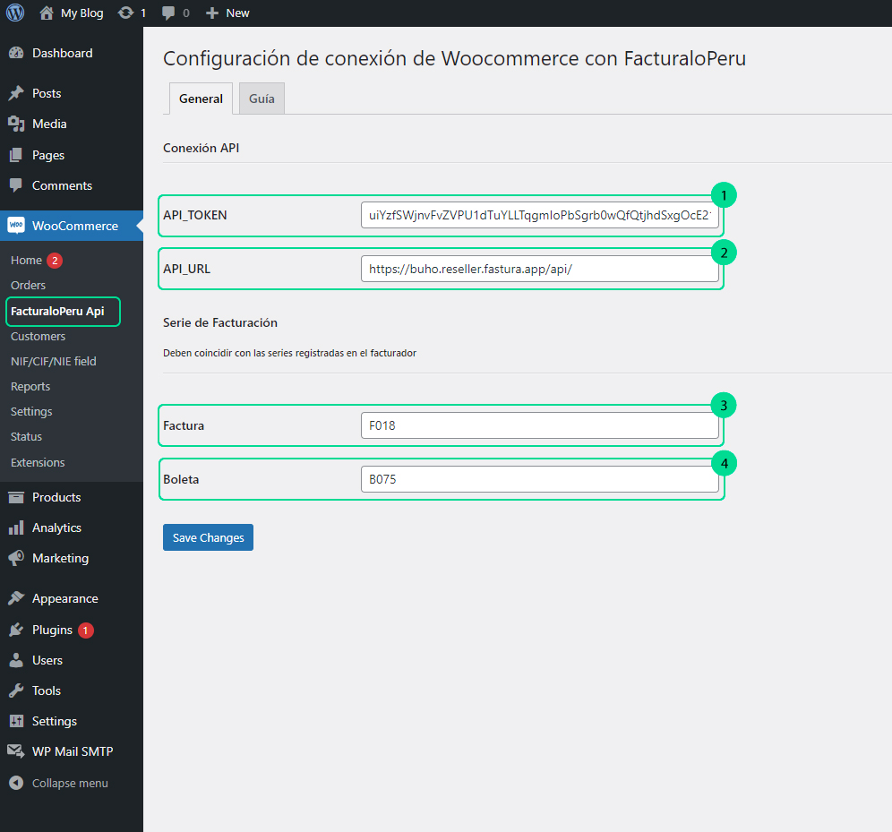
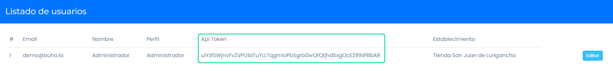
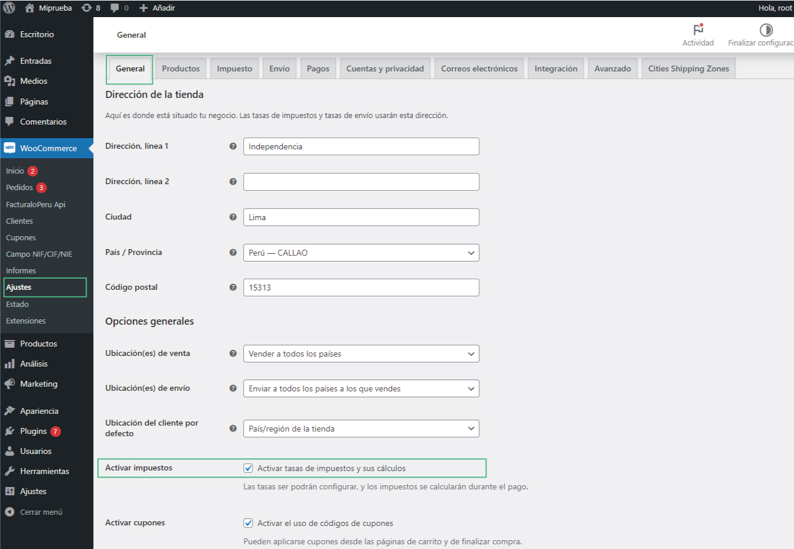
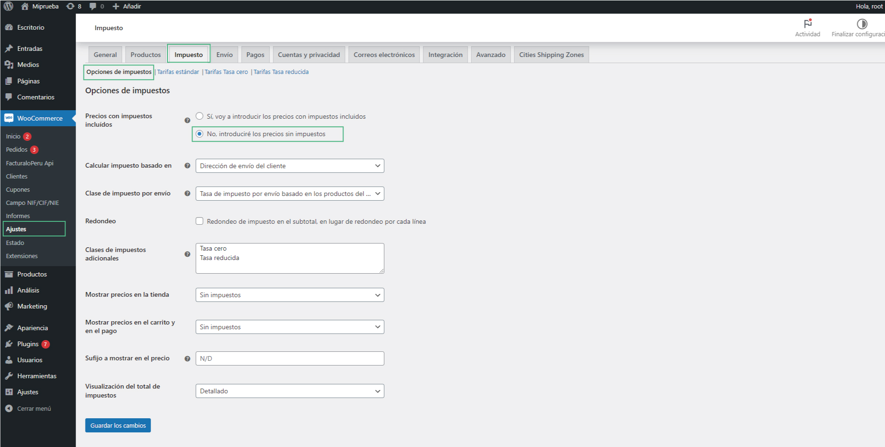
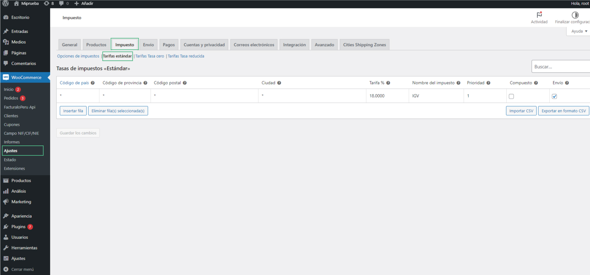

## Introducción

El plugin de facturación electrónica brindará una solución integral para generar comprobantes electrónicos directamente desde una tienda en línea. Además, permite realizar un seguimiento en tiempo real del estado actual de tus comprobantes y sincronizará automáticamente el inventario.

En este artículo te enseñaremos a descargar el plugin para activarlo en tu WordPress. Sigue estos pasos para realizarlo:

Descarga los siguientes plugins:

* WooCommerce
* WC - APG NIF/CIF/NIE Field
* FacturaloPeru
* Ubigeo-peru

<Note>
  Debes tener una instalación limpia de WordPress superior a la versión 5.0.1
</Note>

## Instalación de los plugins necesarios

<Steps>
  <Step title="Plugin WC - APG NIF/CIF/NIE Field">
    Para instalar este plugin, nos dirigimos a **Plugins**, seguido seleccionamos **Añadir nuevo** y buscamos el plugin.
    
    
    
    Este plugin agrega el campo correspondiente al RUC/DNI del cliente, tanto en el formulario de compra como en el detalle del pedido, además de incluirlo en el envío hacia el API.
    
    Selecciona las siguientes casillas de selección:
    
    
    
    <Note>
      Con el plugin Facturaloperu-wp-api-invoice, al completar este campo del formulario con un **DNI/RUC** válido, es capaz de autocompletar los campos correspondientes.
    </Note>
  </Step>
  
  <Step title="Plugin Facturalo 2.0">
    Descarga el plugin desde el siguiente link: **https://conejo.buho.host/facturador.zip**
    
    Se descargará el plugin como archivo comprimido.
    
    Desde el panel de administración de WordPress, ir al menú Plugins -> Añadir nuevo. Pulsar sobre el botón superior "Subir plugin", en la siguiente pantalla aparecerá un botón para seleccionar archivo, cargar el plugin. Seguido el botón **Instalar ahora**.
    
    Para habilitar el plugin, haz clic en el botón **"Activar Plugin"**.
    
    
    
    ### Configuración previa para conectar el API con el sistema de facturación
    
    Es importante configurar los siguientes cuatro parámetros principales para el envío de boletas y facturas; de lo contrario, generará errores al momento de la ejecución.
    
    
    
    Ingresa los siguientes datos:
    
    1. **API_TOKEN:** Ingresa el api-token que se encuentra en tu sistema de facturación, en el módulo Usuarios/Locales & Series, en la subcategoría Usuarios.
    
    
    
    2. **API_URL:** Ingresa la URL de tu sistema de facturación.
    
    <Warning>
      La URL debe contener http o https, el subdominio del cliente en el facturador y finalizar en **/api/** para su correcto funcionamiento.
    </Warning>
    
    3. **FACTURA:** Ingresa la serie que usas para realizar facturas.
    
    4. **BOLETA:** Ingresa la serie que usas para realizar boletas.
    
    Seguido selecciona el botón de **Guardar cambios**.
  </Step>
  
  <Step title="Plugin Ubigeo-peru">
    Descarga el plugin desde el siguiente link: **https://conejo.buho.host/ubigeo.zip**
    
    Se descargará el plugin como archivo comprimido.
    
    Desde el panel de administración de WordPress, ir al menú **Plugins -> Añadir nuevo.** Pulsar sobre el botón superior **"Subir plugin"**, en la siguiente pantalla aparecerá un botón para seleccionar archivo, cargar el plugin. Seguido el botón **Instalar ahora**.
    
    Para habilitar el plugin, haz clic en el botón **"Activar Plugin"**.
    
    Para completar el pedido, sigue los pasos del siguiente **[artículo](https://fastura.github.io/admin/API-rest-documentaci%C3%B3n/Completar-pedido)**.
  </Step>
</Steps>

## Configuración de impuestos

<Steps>
  <Step title="Activar impuestos">
    Para agregar impuestos al producto, marca la siguiente casilla de selección:
    
    
  </Step>
  
  <Step title="Configurar opciones de impuestos">
    Seguido seleccionar la siguiente opción, para no introducir impuestos:
    
    
  </Step>
  
  <Step title="Configurar IGV">
    Para configurar el porcentaje del IGV, complete los siguientes campos tal como se muestra en la imagen:
    
    
  </Step>
</Steps>

## Solución de problemas comunes

<AccordionGroup>
  <Accordion title="Error en la conexión con el API">
    Si el sistema no puede conectarse con el API, verifica que:
    - La URL del API termina en /api/
    - El token API es válido y está activo
    - No existen restricciones de firewall que bloqueen las conexiones
  </Accordion>
  <Accordion title="Problemas con la generación de comprobantes">
    Si los comprobantes no se generan correctamente:
    - Verifica que las series de factura y boleta existan en tu sistema
    - Comprueba que el campo RUC/DNI esté correctamente configurado
    - Asegúrate de que el cliente haya completado todos los campos obligatorios
  </Accordion>
  <Accordion title="Errores con el Ubigeo">
    Si hay problemas con la selección de ubicaciones:
    - Verifica que el plugin Ubigeo-peru esté correctamente instalado y activado
    - Comprueba que las tablas de departamentos, provincias y distritos se hayan importado correctamente
  </Accordion>
</AccordionGroup>

<CardGroup cols={2}>
  <Card 
    title="Verificación de la instalación" 
    icon="check">
    Para verificar que todo esté correctamente instalado, realiza una compra de prueba y verifica que el comprobante se genere adecuadamente.
  </Card>
  <Card 
    title="Soporte técnico" 
    icon="headset">
    Si experimentas problemas con la instalación o configuración, contacta a nuestro equipo de soporte técnico.
  </Card>
</CardGroup>