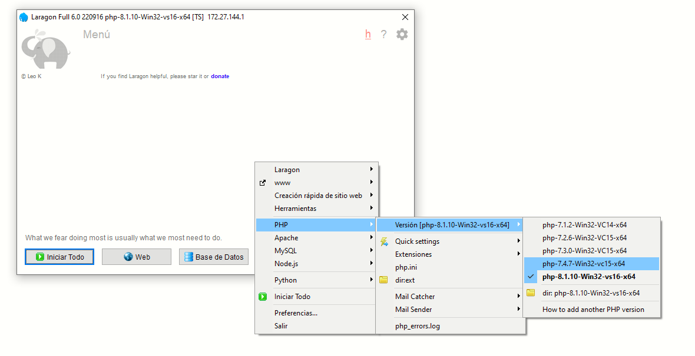
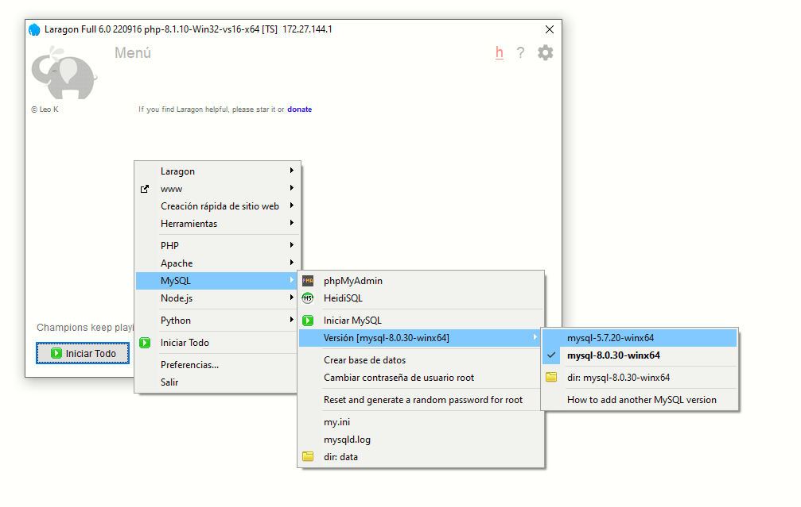
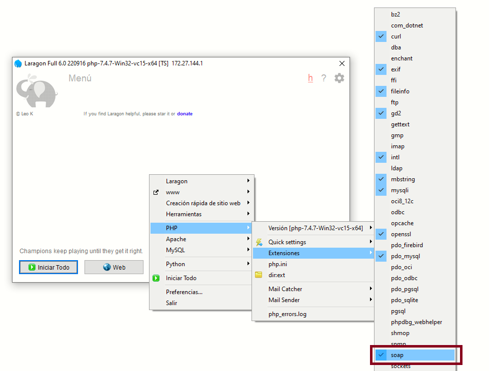
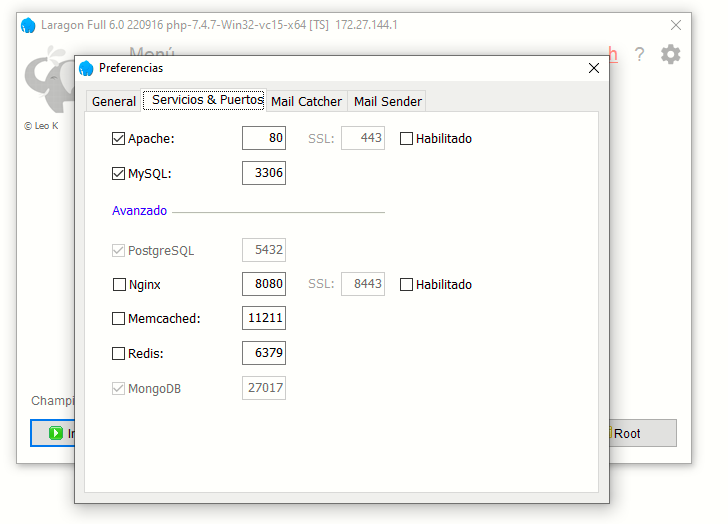
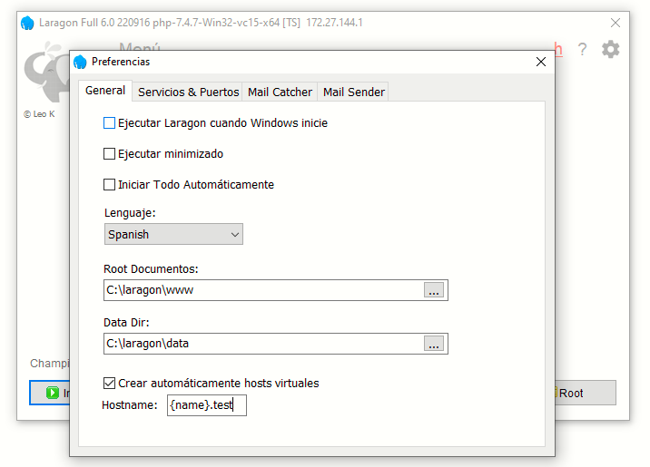
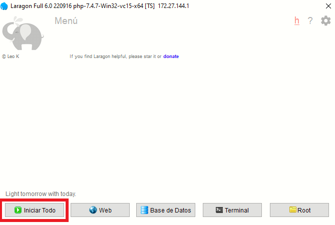
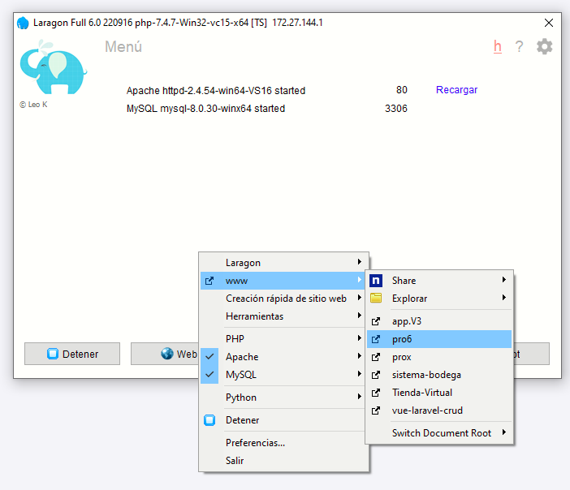
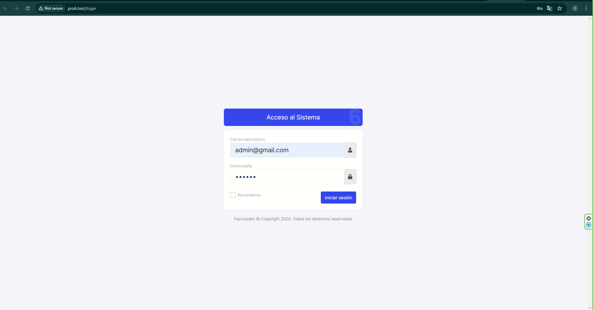

## Introducción

Esta guía explica cómo descargar e instalar el sistema facturador en equipos con Windows. Antes de comenzar, es importante destacar que existen dos versiones del facturador: **Pro6** y **ProX**, cada una con sus propios requisitos técnicos.

<CardGroup cols={2}>
  <Card 
    title="Requisitos Pro6" 
    href="/pro-7/instalaciones/windows#pro6"
    icon="windows">
    Requisitos técnicos para instalar la versión Pro6 del facturador.
  </Card>
  <Card 
    title="Requisitos ProX" 
    href="/pro-7/instalaciones/windows#prox"
    icon="windows">
    Requisitos técnicos para instalar la versión más reciente ProX.
  </Card>
</CardGroup>

## Requisitos previos

### Pro6

| Tecnología | Versión |
|------------|---------|
| PHP        | 7.4     |
| MySQL      | 5.7     |
| Laravel    | 5.6     |
| Node       | 12.22   |

### ProX

| Tecnología | Versión |
|------------|---------|
| PHP        | 8.1     |
| MySQL      | ^5.7    |
| Laravel    | ^9.0    |
| Node       | ^14.17  |

## Preparación del entorno

Las siguientes instrucciones aplican para ambas versiones del facturador. Asegúrate de descargar las versiones correctas según el proyecto que desees instalar.

### Instalación de Laragon

Para ejecutar el facturador necesitarás un entorno de desarrollo. Recomendamos Laragon por su facilidad de uso y configuración.

1. Descarga Laragon desde [su sitio oficial](https://laragon.org/download/) (recomendamos la versión completa)
2. Sigue el asistente de instalación con las opciones predeterminadas

<Note>
  Laragon proporciona un entorno completo que incluye Apache, MySQL, PHP y otras herramientas necesarias para ejecutar aplicaciones web basadas en PHP.
</Note>

### Instalación de PHP

Debes instalar la versión específica de PHP requerida según la versión del facturador:

1. Descarga el archivo ZIP de PHP desde el [Repositorio oficial de PHP](https://windows.php.net/downloads/releases/archives/)
   - Para Pro6: Usa la versión **php-7.4.7-Win32-vc15-x64**
   - Para ProX: Usa la versión **php-8.1.x-Win32-vs16-x64**

2. Navega a la carpeta de instalación de Laragon `C:\laragon\bin\php`

3. Extrae el archivo ZIP dentro de esta carpeta

4. Configura la versión de PHP como predeterminada en Laragon:
   - Haz clic derecho en el ícono de Laragon
   - Selecciona PHP > Versión > [tu versión instalada]



<Warning>
  Asegúrate de activar la extensión SOAP en PHP. Esta extensión es crítica para la creación de facturas y otras funcionalidades del sistema.
</Warning>

### Instalación de MySQL

1. Descarga MySQL desde el [archivo oficial de MySQL](https://downloads.mysql.com/archives/community/)
   - Para ambas versiones: MySQL 5.7.20-winx64 es recomendado

2. Navega a `C:\laragon\bin\mysql`

3. Extrae el archivo ZIP descargado en esta ubicación

4. Configura esta versión como predeterminada en Laragon:
   - Haz clic derecho en el ícono de Laragon
   - Selecciona MySQL > Versión > [tu versión instalada]



## Configuración de Laragon

### Extensiones PHP requeridas

Asegúrate de tener activada la extensión SOAP en PHP:

1. Haz clic en el botón de Menú en Laragon
2. Selecciona PHP > Extensiones PHP > Marca "soap"



### Configuración de puertos

Si tienes problemas con puertos ocupados, puedes cambiarlos fácilmente:

1. Haz clic en el ícono de configuración (tuerca) en Laragon
2. Selecciona "Servicios & Puertos"
3. Modifica los puertos según sea necesario



### Configuración de nombres de host

Laragon crea automáticamente dominios locales para tus proyectos:

1. Haz clic en el ícono de configuración (tuerca)
2. Selecciona la opción "Preferencias"
3. En "Hostname", personaliza el formato que deseas (por ejemplo: `{name}.test`, `{name}.local`)



## Instalación del facturador

Sigue estos pasos para instalar el sistema:

### 1. Clonar el repositorio

1. Abre Laragon y haz clic en "Terminal"
2. Navega a la carpeta `C:\laragon\www`
3. Clona el repositorio con Git:

```bash
git clone [URL_DEL_REPOSITORIO]
```

4. Introduce tus credenciales cuando se soliciten

### 2. Crear la base de datos

1. Desde Laragon, abre la herramienta de base de datos (botón "Base de datos")
2. Selecciona una sesión existente o crea una nueva
3. Haz clic derecho en el panel izquierdo y selecciona "Crear nueva" > "Base de datos"
4. Asigna un nombre a tu base de datos (sin caracteres especiales)

<Tip>
  Anota el nombre de la base de datos que creaste, lo necesitarás en pasos posteriores.
</Tip>

### 3. Configurar el proyecto

1. Entra a la carpeta del proyecto:

```bash
cd pro6
```

2. Crea el archivo de entorno:

```bash
cp .env.example .env 
```

3. Edita el archivo `.env` para configurar:
   - La URL base: `APP_URL_BASE={carpeta}.test`
   - La conexión a la base de datos: `DB_DATABASE={nombre_de_tu_base_de_datos}`

### 4. Instalar dependencias

```bash
composer install
```

### 5. Finalizar la configuración

Ejecuta los siguientes comandos uno por uno:

```bash
php artisan key:generate
composer dump-autoload
php artisan migrate --seed
php artisan storage:link
```

### 6. Iniciar el servidor

1. En la interfaz principal de Laragon, haz clic en "Iniciar todo"
2. Espera a que todos los servicios se inicien (los indicadores deben ponerse en verde)



### 7. Acceder al sistema

1. Haz clic derecho en el ícono de Laragon
2. Selecciona "www" 
3. Haz clic en el nombre de tu proyecto



4. Utiliza las siguientes credenciales para iniciar sesión:
   - Correo electrónico: **admin@gmail.com**
   - Contraseña: **123456**



## Solución de problemas comunes

<AccordionGroup>
  <Accordion title="Error de puerto en uso">
    Cambia los puertos en la configuración de Laragon si otros servicios están utilizando los puertos predeterminados.
  </Accordion>
  <Accordion title="Error al crear tablas en la base de datos">
    Verifica que la versión de MySQL sea compatible y que las credenciales en el archivo .env sean correctas.
  </Accordion>
  <Accordion title="Extensiones PHP faltantes">
    Asegúrate de que todas las extensiones requeridas estén activadas en PHP (especialmente soap, gd, zip, pdo_mysql).
  </Accordion>
</AccordionGroup>

## Recursos adicionales

<CardGroup cols={2}>
  <Card 
    title="Documentación Laravel" 
    href="https://laravel.com/docs" 
    icon="laravel">
    Consulta la documentación oficial de Laravel para más información sobre el framework.
  </Card>
  <Card 
    title="Documentación PHP" 
    href="https://www.php.net/docs.php" 
    icon="php">
    Referencia oficial del lenguaje PHP y sus funciones.
  </Card>
</CardGroup>