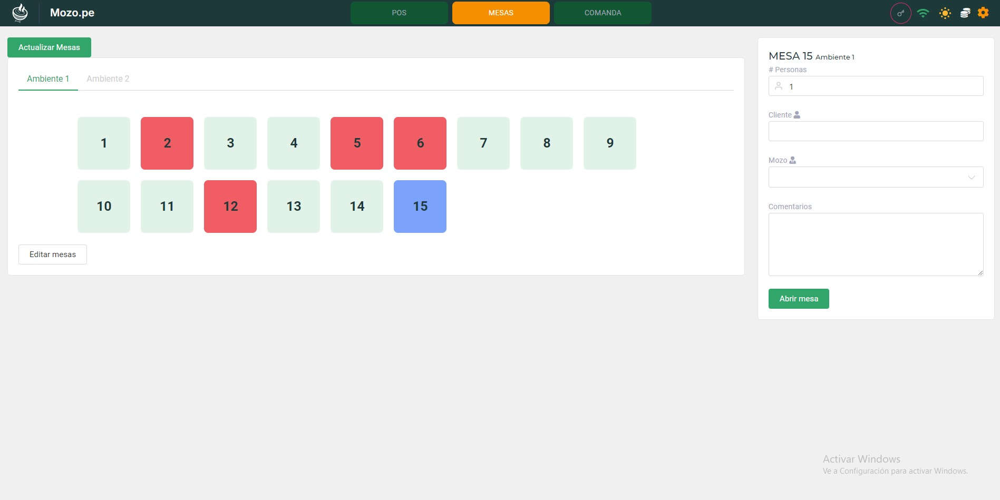

## Módulo Mesa

El **Módulo Mesa** permite a los mozos gestionar de manera eficiente las mesas del restaurante, asignar pedidos y coordinar con la cocina para la preparación de los platillos. Los mozos pueden seleccionar una mesa, tomar el pedido de los clientes y luego enviarlo a la cocina mediante una **comanda**, que puede imprimirse para facilitar el trabajo del equipo de cocina.

### Estados de las mesas

Cada mesa tiene un indicador visual que muestra su estado actual:

<CardGroup cols={3}>
  <Card title="Amarillo" icon="circle" color="#FFD700">
    La mesa está **ocupada** con clientes.
  </Card>
  <Card title="Verde" icon="circle" color="#00FF00">
    La mesa está **libre** y disponible para asignar a nuevos clientes.
  </Card>
  <Card title="Celeste" icon="circle" color="#87CEEB">
    La mesa **no tiene órdenes pendientes**, pero aún no ha sido cerrada.
  </Card>
</CardGroup>

Además, cada mesa registra el **tiempo desde que fue abierta**, permitiendo que el personal de servicio tenga control sobre la duración del servicio y agilice la rotación de las mesas.

### Proceso de gestión de mesas

<Steps>
  <Step title="Seleccionar la mesa">
    - El mozo selecciona la mesa donde se sentarán los clientes.
    - Indica la cantidad de personas que ocuparán la mesa.
    - Opcionalmente, puede ingresar el nombre del cliente.
    - Se selecciona al mozo que está atendiendo la mesa, previamente configurado en el panel administrativo.
    - Puede agregar comentarios adicionales, como requerimientos especiales para la mesa.
  </Step>
  
  <Step title="Seleccionar los platillos">
    - El mozo selecciona los platillos solicitados por los clientes.
    - Una vez seleccionados los platillos, se presentan las siguientes opciones para continuar:
      - **Precuenta**: Se genera una precuenta para que los clientes revisen el monto total antes de realizar el pago.
      - **Enviar a comanda**: Los platillos se envían a la cocina, donde la comanda puede ser impresa o vista digitalmente para comenzar la preparación.
      - **Cerrar mesa**: Finaliza la atención de la mesa y procede con el cierre de la cuenta.
    
    <Warning>
      La comanda puede ser impresa o visualizada digitalmente por el equipo de cocina. **Una vez enviada la comanda, no podrá ser eliminada ni reenviada.**
    </Warning>
  </Step>
  
  <Step title="Finalizar venta">
    - Al momento de cerrar la mesa, solo los administradores pueden **Finalizar Venta** para generar el comprobante correspondiente.
    - Similar al módulo POS, se puede seleccionar qué tipo de comprobante emitir (boleta, factura, etc.) y la **serie** con la que se desea emitir el comprobante.
    
    <Warning>
      El usuario con rol de mozo no puede Finalizar la venta
    </Warning>
  </Step>
</Steps>

<Note>
  Este proceso asegura que los pedidos se gestionen de manera precisa y eficiente, minimizando errores en la cocina y permitiendo que el cobro final se realice correctamente, con un control adecuado sobre los comprobantes emitidos.
</Note>

## Funcionalidades adicionales

<AccordionGroup>
  <Accordion title="Gestión de tiempos">
    El sistema registra el tiempo de ocupación de cada mesa, permitiendo analizar la rotación y optimizar el servicio.
  </Accordion>
  <Accordion title="Modificación de órdenes">
    Se pueden agregar nuevos productos a una mesa con orden existente, pero una vez enviada la comanda a cocina, no se podrán eliminar los productos ya ordenados.
  </Accordion>
  <Accordion title="Transferencia de mesas">
    El administrador puede transferir clientes entre mesas cuando sea necesario, manteniendo el registro de pedidos intacto.
  </Accordion>
</AccordionGroup>