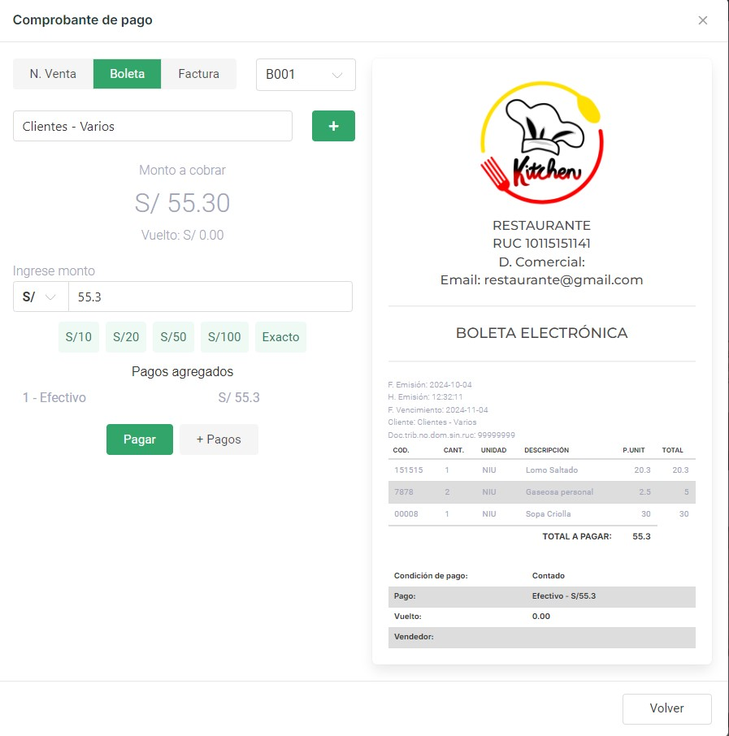

## Módulo POS

El **Módulo POS** es una herramienta clave dentro del Sistema para Mozo, que permite gestionar de manera rápida y eficiente los pedidos, especialmente cuando los clientes solicitan comida para llevar.

Este módulo facilita la preparación de los comprobantes de venta y ofrece una interfaz amigable donde se muestran las categorías de productos disponibles. Además, cuenta con un **input de búsqueda** que permite localizar productos de manera rápida, ya sea escribiendo el nombre del producto o utilizando un **lector de código de barras**.

<Steps>
  <Step title="Buscar y seleccionar productos">
    Utiliza el campo de búsqueda para encontrar productos por nombre o escanea el código de barras con un lector. Selecciona los productos solicitados por el cliente para agregarlos al pedido.
  </Step>
  
  <Step title="Configurar cantidades y opciones">
    Ajusta las cantidades de cada producto y configura las opciones específicas solicitadas por el cliente.
  </Step>
  
  <Step title="Finalizar venta">
    Una vez que el pedido está listo, selecciona la opción de **Finalizar Venta**. El sistema presentará un menú que permite elegir:
    
    - Tipo de comprobante (boleta, factura, etc.)
    - Cliente asignado al comprobante
    - Serie del comprobante
    
    
  </Step>
</Steps>

<CardGroup cols={2}>
  <Card 
    title="Ventas rápidas" 
    icon="bolt">
    Este flujo optimizado ayuda a los mozos a gestionar las ventas de comida para llevar de manera ágil, mejorando tanto la eficiencia del servicio como la satisfacción del cliente.
  </Card>
  <Card 
    title="Reporte de ventas" 
    icon="chart-line">
    Todas las ventas realizadas a través del POS se registran automáticamente en el sistema para su posterior análisis y consulta.
  </Card>
</CardGroup>